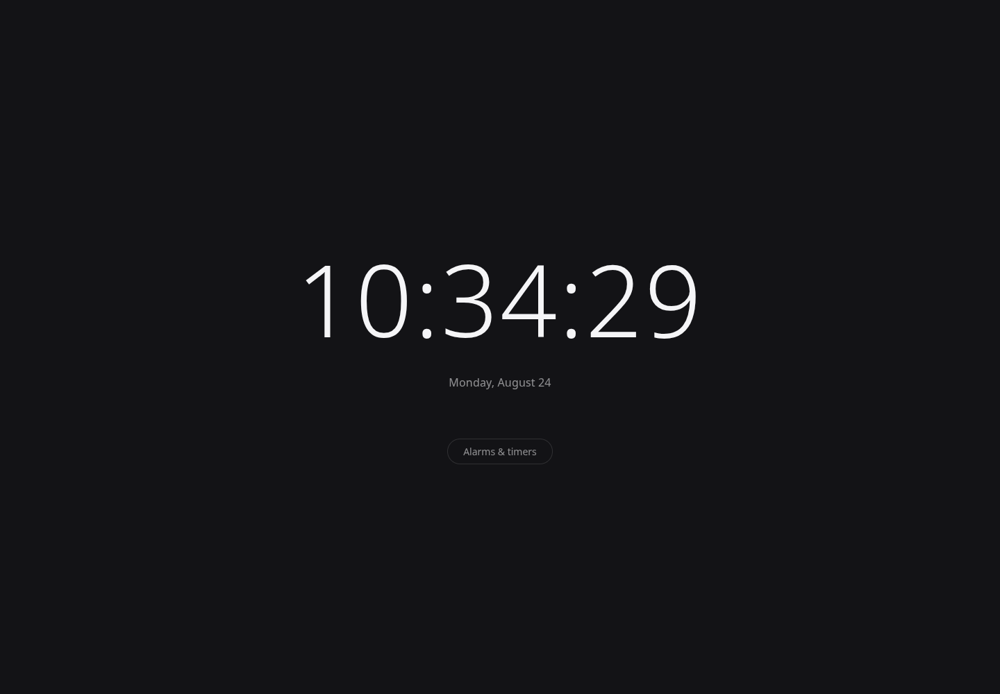

# Chronly

**The clock extension that just works.**

Chronly is a fast, private, open-source browser extension for Chrome and Firefox: a clean clock dashboard on your New Tab page, and a toolbar popup with world clocks, alarms, a timer/stopwatch, and Pomodoro sessions. No ads, no tracking, no account, no artificial limits.

[](LICENSE)




## Quick Start

**As a user:**

- Chrome Web Store: not published yet
- Firefox Add-ons: not published yet

Until then, you can build and load it yourself with the steps below.

**As a developer, running it locally:**

```bash
npm install
npm run dev            # Chrome, with hot reload
npm run dev:firefox    # Firefox, with hot reload
```

To load a built version manually:

1. Run `npm run build` (Chrome) or `npm run build:firefox` (Firefox).
2. **Chrome:** open `chrome://extensions`, enable "Developer mode", click "Load unpacked", and select `.output/chrome-mv3/`.
3. **Firefox:** open `about:debugging#/runtime/this-firefox`, click "Load Temporary Add-on", and select any file inside `.output/firefox-mv3/`.

## Features

The popup is a tabbed control center: clock, alarms, timers and stopwatch, world clocks, Pomodoro, and settings.

- **Clock** — digital and analog faces, or both at once; 12- or 24-hour; optional seconds; adjustable text size and clock contrast.
- **World clocks** — unlimited saved zones, each showing its local time, UTC offset, a plain-text difference from your own zone, and an at-a-glance "working hours / off hours / asleep" read on the people there. Meeting-planner mode lets you pick a time and see every saved zone re-rendered at it. Zones come from your browser's own time zone database, so there's no bundled city list to go stale.
- **Alarms** — one-off or repeating on chosen weekdays, with a choice of alert tone, a volume slider, a "test" button that fires the real notification and sound so you can confirm both work, a 5-minute snooze, and redundant firing (system notification _and_ sound) so one blocked channel can't cause a silent miss.
- **Timer & stopwatch** — several countdown timers running at once, with pause/resume, quick presets, and per-timer tone and volume; plus a stopwatch with lap splits that highlights the fastest and slowest lap. Both survive the popup closing and the browser restarting.
- **Pomodoro** — configurable focus, short-break, and long-break lengths (or one of three presets), automatic phase transitions run by the background worker rather than by an open tab, and focus-session stats kept on your device.
- **Theme & background** — a light, dark, or automatic theme and a solid, preset/custom gradient, remote URL, or locally uploaded image background for the New Tab dashboard; the accent can be picked from the active background, plus a reduced-motion switch.
- **Calendar export** — add an alarm, or the remainder of the running Pomodoro phase, to Google Calendar via a prefilled link, or download an `.ics` for Outlook/Apple Calendar. No sign-in, no extra permission.

One caveat worth stating up front: Firefox does not support buttons on notifications, so the Snooze/Dismiss/Pause buttons appear on Chrome only. On Firefox, closing the notification dismisses it.

## Permissions

Chronly asks for the minimum needed to do its job, and nothing else. This table is the full contents of `permissions` in the built manifest:

| Permission                | Why                                                                                                                                                                  |
| ------------------------- | -------------------------------------------------------------------------------------------------------------------------------------------------------------------- |
| `alarms`                  | Wakes the background process on a schedule so alarms, timers, and Pomodoro phases still fire after the browser has suspended it.                                     |
| `notifications`           | Shows the system notification when an alarm, timer, or Pomodoro phase completes.                                                                                     |
| `storage`                 | Saves your alarms, timers, and stopwatch on this device, and your world clocks and settings in browser sync storage so they follow your signed-in profile.           |
| `offscreen` (Chrome only) | Lets Chrome play the alarm sound — its background service worker has no audio API of its own. Firefox's background page plays audio directly and does not need this. |

No `host_permissions`, no analytics SDK, no account, no server Chronly talks to. The alert tones are synthesized on the fly with the Web Audio API rather than fetched, so nothing is downloaded when an alarm rings.

See the full [privacy policy](docs/PRIVACY.md) for the storage and permission details.

## Why Chronly

Most clock/alarm/timer extensions are either bare-bones or unreliable — alarms that silently never fire, timers that reset when a tab closes, free-tier limits that shrink over time. Chronly is built around one bet: reliability is the feature that matters most.

- Every alarm, timer, and Pomodoro session is persisted as an absolute target time, not a running countdown in memory — so it survives the background process being suspended, the browser restarting, or your computer going to sleep.
- The popup and the background worker share one source of truth (extension storage) instead of messaging each other, so a closed popup or an evicted worker can't desynchronise them.
- Alarms fire redundantly (sound and notification together) so one blocked channel doesn't mean a silent miss.
- No caps on the number of alarms, timers, or world clocks you can save.
- No tracking, no ads, no account — ever.

## Project layout

```
entrypoints/    # background worker, popup, New Tab override, offscreen audio document
lib/core/       # framework-agnostic logic: storage, scheduling, timezone math,
                # calendar export, notifications, audio. Unit-tested, no UI code.
lib/ui/         # thin Svelte store wrappers around lib/core
components/     # shared Svelte UI (ClockFace, AlarmsPanel, WorldClockPanel, ...)
harness/        # standalone Vite preview of the popup and New Tab pages
```

Useful scripts:

```bash
npm test               # Vitest unit and component tests
npm run typecheck      # tsc --noEmit
npm run lint           # ESLint
npm run format         # Prettier
npm run preview:popup  # run the popup in a plain browser tab, no extension reload needed
npm run zip            # package for the Chrome Web Store (npm run zip:firefox for AMO)
npm run lint:firefox   # validate the built Firefox artifact with Mozilla's linter
npm run verify:manifests # check Chrome/Firefox manifest invariants after building
```

CI runs `typecheck`, `lint`, `test`, and both builds on every pull request.

Release steps live in [RELEASING.md](RELEASING.md).

## Contributing

Chronly is open source and contributions are very welcome — code, bug reports, translations, or just testing an alarm on a browser we haven't verified yet. See [CONTRIBUTING.md](CONTRIBUTING.md) for local setup and how the codebase fits together, and look for issues labeled `good first issue` if you're not sure where to start.

If Chronly is useful to you, a star helps other people find it.

## License

[MIT](LICENSE)
