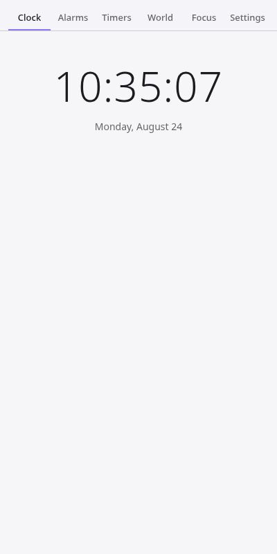
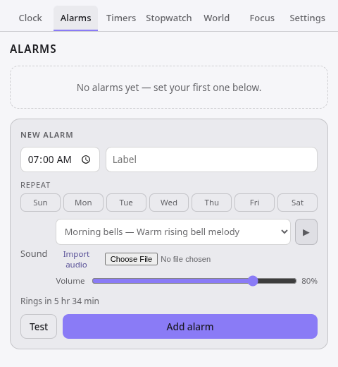

# Chronly

**A calm, private clock and alarm workspace for your browser.**

[](https://github.com/fredrikblau/chronly/actions/workflows/ci.yml)
[](LICENSE)
[](README.md#quick-start)
[](README.md#quick-start)

Chronly is an open-source Chrome and Firefox extension for alarms, timers,
stopwatch laps, world clocks, and focused work sessions. It has no ads,
tracking, account, server, or artificial limits.




## Quick Start

**As a user:**

- Chrome Web Store: not published yet
- Firefox Add-ons: not published yet

**As a tester:**

- [Chronly 0.1.0 RC3](https://github.com/fredrikblau/chronly/releases/tag/v0.1.0-rc.3)
  provides a Chrome developer-mode build and a temporary Firefox build. The
  release notes list the remaining manual checks.

You can also build and load Chronly with the steps below. Contributors can try
a change in a real browser in a few minutes.

**As a developer:**

```bash
npm install
npm run dev            # Chrome, with hot reload
npm run dev:firefox    # Firefox, with hot reload
```

To load a built version:

1. Run `npm run build` (Chrome) or `npm run build:firefox` (Firefox).
2. **Chrome:** open `chrome://extensions`, enable "Developer mode", click "Load unpacked", and select `.output/chrome-mv3/`.
3. **Firefox:** open `about:debugging#/runtime/this-firefox`, click "Load Temporary Add-on", and select any file inside `.output/firefox-mv3/`.

### Firefox source review build

AMO reviewers can use Mozilla's default Ubuntu 24.04 environment with Node
24.14.0 and npm 11.9.0. From the source archive root:

```bash
npm ci
npm run build:firefox
```

The reviewable extension is written to `.output/firefox-mv3/`. The build uses
the open-source packages pinned in `package-lock.json`; it needs no
network service after `npm ci` completes.

## Features

The popup is a tabbed control center: clock, alarms, timers and stopwatch, world clocks, Pomodoro, and settings.

- **Clock:** digital and analog faces, or both at once; 12- or 24-hour; optional seconds; adjustable text size and clock contrast.
- **World clocks:** unlimited saved zones, each showing its local time, UTC offset, a plain-text difference from your own zone, and an at-a-glance "working hours / off hours / asleep" read on the people there. Meeting-planner mode lets you pick a time and see each saved zone at it. Zones come from your browser's time zone database, so there is no bundled city list to go stale.
- **Alarms:** one-off or repeating on chosen weekdays, with selectable alert tones, a volume slider, a "test" button, and sound that repeats until you snooze or dismiss the notification. Chronly sends a system notification and plays sound so one blocked channel cannot cause a silent miss.
- **Sounds:** eight bundled CC0 chimes with previews, plus import of your own MP3, WAV, OGG, M4A, AAC, FLAC, or WebM file. Imported audio stays in local extension storage.
- **Timer & stopwatch:** several countdown timers running at once, with pause/resume, quick presets, and per-timer tone and volume; plus a dedicated stopwatch tab with lap splits that highlights the fastest and slowest lap. Both survive the popup closing and the browser restarting.
- **Pomodoro:** configurable focus, short-break, and long-break lengths (or one of three presets), background phase transitions, and focus-session stats kept on your device.
- **Theme & background:** a light, dark, or automatic theme with reduced motion, adjustable text size, clock contrast, and solid or gradient popup backgrounds. Your browser’s default New Tab page remains unchanged.
- **Calendar export:** add an alarm, or the remainder of the running Pomodoro phase, to Google Calendar via a prefilled link, or download an `.ics` for Outlook/Apple Calendar. No sign-in, no extra permission.

Firefox does not support buttons on notifications, so the Snooze, Dismiss, and Pause buttons appear on Chrome. Closing a Firefox notification dismisses it.

## Permissions

Chronly asks for the minimum needed to do its job, and nothing else. This table is the full contents of `permissions` in the built manifest:

| Permission                | Why                                                                                                                                                    |
| ------------------------- | ------------------------------------------------------------------------------------------------------------------------------------------------------ |
| `alarms`                  | Wakes the background process on a schedule so alarms, timers, and Pomodoro phases still fire after the browser has suspended it.                       |
| `notifications`           | Shows the system notification when an alarm, timer, or Pomodoro phase completes.                                                                       |
| `storage`                 | Saves alarms, timers, stopwatch, Pomodoro stats, and imported audio on this device; world clocks and small settings may use browser sync storage.      |
| `offscreen` (Chrome only) | Lets Chrome play the alarm sound because its background service worker has no audio API. Firefox's background page plays audio and does not need this. |

No `host_permissions`, no analytics SDK, no account, no server Chronly talks to. Alert tones are bundled with the extension, and imported audio remains in local extension storage, so nothing is downloaded when an alarm rings.

See the full [privacy policy](docs/PRIVACY.md) for the storage and permission details.

## Why Chronly

Chronly treats reliability as its primary feature.

- Chronly persists each alarm, timer, and Pomodoro session as an absolute target time, so it survives background suspension, browser restarts, and computer sleep.
- The popup and the background worker share one source of truth (extension storage) instead of messaging each other, so a closed popup or an evicted worker can't desynchronise them.
- Chronly sends sound and a notification together so one blocked channel does not cause a silent miss.
- No caps on the number of alarms, timers, or world clocks you can save.
- No tracking, ads, or account.

## Contributing

Good first contributions include improving accessibility, adding browser-level
coverage, refining sound controls, and documenting manual release checks. Read
[CONTRIBUTING.md](CONTRIBUTING.md), then look for issues labeled
[`good first issue`](https://github.com/fredrikblau/chronly/issues?q=is%3Aissue+is%3Aopen+label%3A%22good+first+issue%22).

Please open an issue before large architectural changes. Pull requests should
include tests for behavior changes and keep Chronly private by default: no
telemetry, accounts, broad host permissions, or remote runtime code.

## Project layout

```
entrypoints/    # background worker, popup, and offscreen audio document
lib/core/       # framework-agnostic logic: storage, scheduling, timezone math,
                # calendar export, notifications, audio. Unit-tested, no UI code.
lib/ui/         # thin Svelte store wrappers around lib/core
components/     # shared Svelte UI (ClockFace, AlarmsPanel, WorldClockPanel, ...)
harness/        # standalone Vite preview of the popup
```

Useful scripts:

```bash
npm test               # Vitest unit and component tests
npm run typecheck      # tsc --noEmit
npm run lint           # ESLint
npm run format         # Prettier
npm run preview:popup  # run the popup in a plain browser tab, no extension reload needed
npm run zip            # package for the Chrome Web Store (npm run zip:firefox for AMO)
npm run lint:firefox   # validate the built Firefox artifact with Mozilla's linter
npm run verify:manifests # check Chrome/Firefox manifest invariants after building
```

CI runs typecheck, lint, unit tests, all three release packages, manifest
validation, Firefox artifact lint, and the Chromium extension smoke tests on
every pull request.

Release steps live in [RELEASING.md](RELEASING.md).
Store copy, reviewer notes, and image requirements live in
[docs/STORE_LISTING.md](docs/STORE_LISTING.md).

If Chronly is useful to you, a star helps other people find it.

## License

[MIT](LICENSE)
